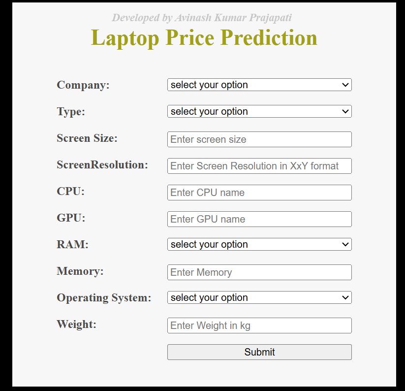

# Laptop Price Prediction

This project focuses on analyzing, preprocessing a dataset of laptops to understand key features that affect laptop pricing. The dataset includes attributes like brand, type, screen resolution, CPU, RAM, GPU, operating system, and more. This dataset is used to train a ML model to predict the price of Laptop based on its features.

## Dataset Overview

- **Total Entries**: 1303
- **Columns**: 11
- **Target Variable**: 'Price'

### Features:

| Column             | Description                                                  |
|--------------------|--------------------------------------------------------------|
| Company            | Laptop manufacturer (e.g., Apple, HP, Lenovo, etc.)          |
| TypeName           | Type of laptop (e.g., Ultrabook, Gaming, Notebook)           |
| Inches             | Screen size in inches                                        |
| ScreenResolution   | Resolution and panel type                                    |
| Cpu                | CPU brand and model                                          |
| Ram                | RAM size (e.g., 8GB, 16GB)                                   |
| Memory             | Storage volume and storage type (e.g., SSD, HDD, Hybrid)     |
| Gpu                | GPU brand and model                                          |
| OpSys              | Operating System (e.g., Windows, macOS, Linux)               |
| Weight             | Weight of the laptop                                         |
| Price              | Selling price of the laptop in INR                           |

## Exploratory Data Analysis

Several insights were discovered:
- Maximum laptops sold are from Dell, Lenovo and HP brands.
- Notebook type laptops are the most common.
- Laptops with 8GB RAM are the most common.
- Maximum laptops sold are having Windows 10 as the operating system.
- Maximum laptops sold are having 1920x1080 as the screen resolution.
- Laptops with SSD memory storage are the most common.
- Maximum laptops sold are having weight around 2kg and screen size around 15 inches.
- Average Price of 'Razer' brand laptop is the most.
- Workstation type laptops are having higher average price than the others.
- Laptops with 64GB and 32GB RAM are having higher average price than the others.
- Laptops with 'macOS' and 'Windows 7' OpSys are having higher average price than the others.
- The screen resolution of laptops with higher average price are '2880x1800', '3840x2160' and '2560x1440'

## Preprocessing Steps

The following preprocessing steps were applied:

- **Data Cleaning**: Checked and removed null and duplicate values.
- **Remove Outliers**: Checked and removed price outliers.
- **Feature Engineering**:
  - Converted 'Ram', 'Weight' to numeric values.
  - Extracted resolution width × height and type from 'ScreenResolution'.
  - Extracted storage volume and storage type from 'Memory'
- **Encoding**: One-hot encoding for categorical variables.
- **Scaling**: Standard Scaling for both categorical and numerical variables.

## Model Training :
-  In this phase mutltiple models were tested along with hyperparameter tuning such as Linear Regression, KNN, Decision Tree, Random Forest, Gradient Boosting, AdaBoost, CatBoost, XGBoosting, Lasso and Ridge.
-  Then the model with best R2_score was chosen as our best model.
  
## Flask App :
Flask app is created with User Interface to get inputs from the user and predict the Laptop Price.

### Snapshot of the App:
